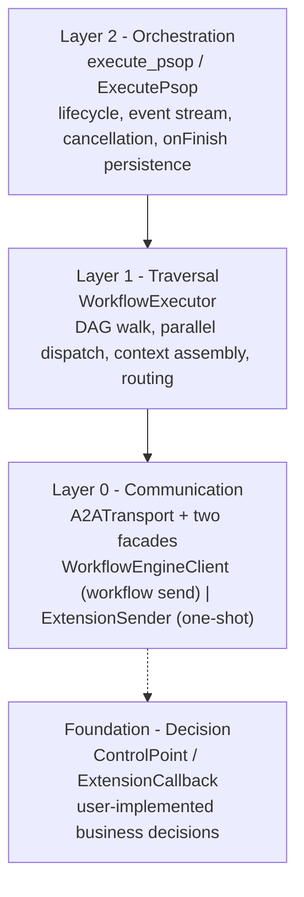
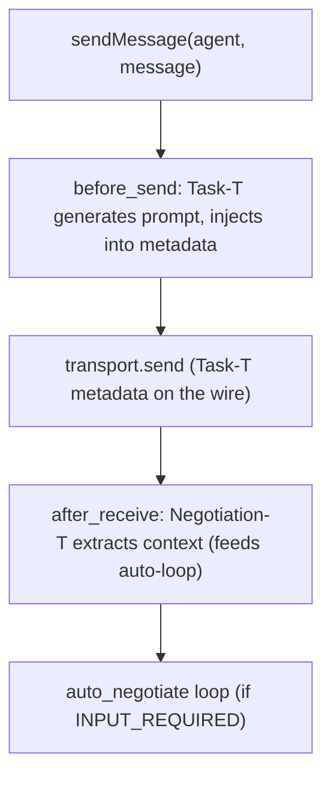
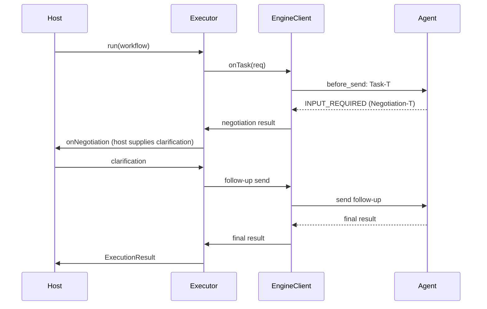
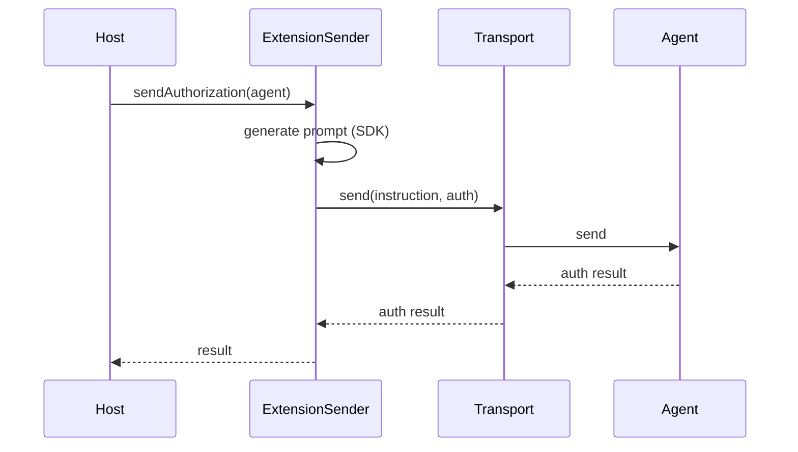
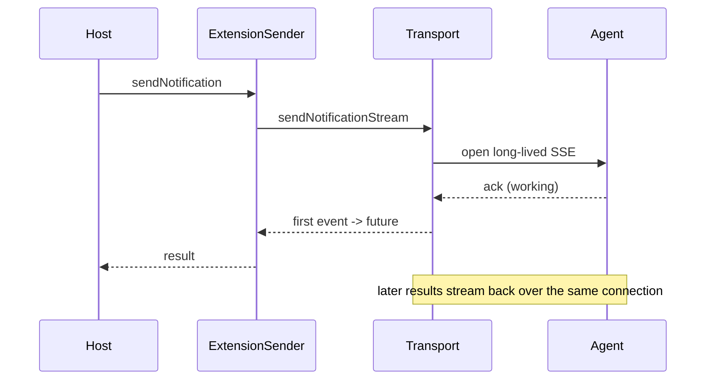

# A2A-T Engine SDK - Design

> Architecture and design rationale for the `a2at-engine` Python SDK and the
> `a2at-engine-java` Java SDK. This document describes the system as shipped
> in v1.0; the two SDKs are intentionally parallel and maintain feature
> parity. It is written for engineers integrating or extending the SDK, not
> as a walkthrough of any particular bug-fix history.

---

## 1. Overview

The A2A-T Engine SDK lets a host agent execute multi-step workflows over the
A2A protocol with A2A-T telecom extensions. A workflow is a directed
acyclic graph (DAG) of steps; each step dispatches one or more tasks to
remote agents and routes to the next step. The SDK owns the protocol
mechanics - message send, streaming, authentication, Task-T prompt
generation, the Negotiation-T auto-loop - and exposes a small set of
decision interfaces the host implements for business logic.

The guiding principle is a clean separation between **mechanics the SDK
owns** and **decisions the host owns**:

| The SDK owns (protocol mechanics) | The host owns (business decisions) |
|---|---|
| A2A message send, streaming, SSE normalization | Whether and when to send a task |
| Agent authentication (Bearer, custom headers) | Credential configuration |
| A2A-T extensions (Task-T, Negotiation-T, Authorization-T, Notification-T) | Authorization approval, notification handling |
| DAG traversal, context assembly, state management | Branch routing decisions |
| Event emission | Event handling |

---

## 2. Layered Architecture

The SDK is structured in four layers. Each layer builds on the one below;
each has a single responsibility and a clear entry point.

```


### 2.1 Layer 0 - Communication

This layer is the heart of the transport-facade split.

**`A2ATransport`** is the shared wire layer. It owns exactly one concern:
getting bytes to and from remote agents. That means the HTTP client
(httpx in Python, the A2A SDK client runtime in Java), the auth manager and
interceptors, the agent-card map, and the streaming-response consumer. It
exposes two send primitives - `send` (collect-and-return) and
`sendNotificationStream` (long-lived SSE) - plus static extractors that turn
the raw SDK event stream into text, task state, and metadata.

**Two facades sit on top of the transport, each with a single
responsibility:**

- **`WorkflowEngineClient`** - the workflow execution send path. Owns Task-T
  prompt generation (before send), the Negotiation-T auto-loop (after
  receive), the global `EventCallback`, and the `ControlPoint` /
  `ExtensionCallback` wiring. This is the facade the executor calls during
  workflow execution.
- **`ExtensionSender`** - one-shot pre-positioning. Sends Authorization-T
  and Notification-T messages to agents *before* the workflow starts. It
  bypasses Task-T generation and the negotiation loop and does not emit
  events through the global callback - the returned result *is* the
  callback.

#### Why a shared transport with two facades?

Both the workflow send path and the one-shot pre-positioning path need the
same wire-level machinery: an HTTP client, TLS configuration, auth
interceptors, agent-card resolution, and SSE parsing. Putting that machinery
on either facade would either (a) force a caller that only wants to
pre-position to hold the full workflow facade, or (b) duplicate the wire code
across two classes. The shared-transport / two-facade design avoids both:
the wire layer is written once on `A2ATransport`, and each facade delegates
all wire work to it while keeping its own orchestration concern isolated.

### 2.2 Layer 1 - Traversal

**`WorkflowExecutor`** walks the DAG. At each step it assembles upstream
context (`ContextBuilder`), dispatches subtasks concurrently, applies the
step's success policy, and determines the next step(s). It delegates every
*decision* to `ControlPoint` and every *send* to `WorkflowEngineClient`.

Step dispatch rules:

- Steps whose predecessors are all satisfied are collected and dispatched in
  parallel (`asyncio.gather` / `CompletableFuture`), so steps at the same
  layer run concurrently.
- Subtasks within a step also run in parallel.
- `ALL_SUCCESS` - all subtasks must succeed.
- `ANY_SUCCESS` - the first successful subtask wins; the rest are cancelled.
- `SELF_LOOP` - the task is handled locally via `onSelfTask`, with no A2A-T
  message sent to the agent.

### 2.3 Layer 2 - Orchestration

**`execute_psop`** (Python) / **`ExecutePsop`** (Java) is the high-level
runner. It wraps the executor with a lifecycle (start / complete / error /
close), event serialization, client-disconnect cancellation, and an
`onFinish` persistence hook. Most integrations use this layer.

---

## 3. Decision Interfaces

The SDK exposes two user-implemented interfaces, split by responsibility.

### 3.1 ControlPoint - flow decisions

Drives the workflow forward. Each method is called by the executor or the
auto-negotiate loop and makes exactly one decision:

| Method | Called by | Decision |
|---|---|---|
| `onTask` | executor | Send a task to an agent (call `sendMessage`) |
| `onSelfTask` | executor | Handle a self-loop task locally (no A2A-T) |
| `onRoute` | executor | Choose a branch at a conditional step |
| `onNegotiation` | client auto-loop | Supply clarification on INPUT_REQUIRED |

### 3.2 ExtensionCallback - reactive hooks

Reacts to agent-pushed A2A-T data. These are distinct from flow decisions:
they respond to peer-initiated extension traffic rather than driving the
workflow forward.

| Method | Fires when | Decision |
|---|---|---|
| `onAuthorization` | an agent pushes an Authorization-T request in a task response | Approve or deny |
| `onNotification` | an agent pushes a Notification-T payload in a task response | Handle the notification |

#### Why split ControlPoint and ExtensionCallback?

Mixing reactive hooks onto the flow-decision interface couples two
different call sites and two different responsibilities. `onTask` and
`onRoute` are called by the executor as it walks the DAG; `onAuthorization`
and `onNotification` are called by extension handlers reacting to
agent-pushed data. Keeping them on separate interfaces means a host that
only cares about routing does not have to implement (or stub) authorization
hooks, and vice versa.

---

## 4. A2A-T Extension Model

Four A2A-T extensions are supported. They divide into two groups by
lifecycle.

### 4.1 In-workflow extensions

Participate in every `sendMessage` lifecycle through the extension handler
chain (`ExtensionRegistry` pre-registers both):

- **Task-T** - On send, calls the A2A-T SDK to generate a structured task
  prompt from the natural-language message and injects it into the message
  metadata. Skipped for negotiation follow-ups and when the caller pre-sets
  the prompt. On receive: pass-through.
- **Negotiation-T** - On receive, when the agent returns `INPUT_REQUIRED`
  and declares the extension, extracts the negotiation context and message.
  This feeds the auto-loop: the engine calls `ControlPoint.onNegotiation`
  for a clarification, resends the follow-up, and repeats up to a configured
  round limit.

### 4.2 Pre-positioning extensions

One-shot sends that happen before the workflow starts, via `ExtensionSender`:

- **Authorization-T** - Sends an authorization pre-positioning request.
  The prompt value is generated by the A2A-T SDK; the engine falls back to
  the raw natural-language input when SDK generation is unavailable.
- **Notification-T** - Establishes a result subscription. Opens a long-lived
  SSE stream so later recovery results flow back through the response
  stream.

The subscription *result* (e.g. a recovery outcome pushed later) flows back
through the `sendNotification` response stream, not through
`onNotification`. That hook only fires when an agent voluntarily includes a
Notification-T payload in a `sendMessage` task response.

Prompt generation methods for Authorization-T and Notification-T are
reserved on `ExtensionSender`; Task-T uses the SDK's `generateTaskPrompt`.
Negotiation-T and the reserved generators will be wired to the A2A-T SDK as
that support lands upstream.

### 4.3 Extension handler chain



`ExtensionRegistry.getHandlersForExtensions` matches an agent's declared
extension URIs against handler keywords (case-insensitive) and returns the
handler chain for that agent. Authorization-T / Notification-T handler
classes are retained for callers that need inline handling of agent-pushed
data, but they are not auto-registered - that is a pre-positioning concern.

---

## 5. Condition Routing

A step's `next` list holds `JumpCondition(step, condition)` entries. The
routing rule is:

- **No `next`** - terminal; the step completes the branch.
- **All conditions empty** - unconditional fan-out: dispatch every
  non-terminal next step in parallel.
- **Has conditions** - conditional: call `ControlPoint.onRoute`, which
  returns a single `RouteDecision.nextStep`. The engine enforces that the
  returned step is among the declared conditions; an invalid step ends the
  workflow with a warning.

This makes conditional branches an N-choose-1 selection and keeps
unconditional fan-out as automatic parallel dispatch.

---

## 6. Event Model

Events are emitted to an optional `EventCallback` as stable string types
(`EventType`). They are grouped by origin:

- **Runner lifecycle** - `start`, `complete`, `close`
- **Step / task execution** - `step_start`, `step_complete`, `task_request`,
  `task_response`, `task_status_changed`, `route_decision`,
  `workflow_complete`
- **Agent traffic** - `agent_request`, `agent_response`,
  `agent_status_update`, `agent_artifact_update`, `agent_message_event`
- **A2A-T extensions** - `negotiation_request`, `negotiation_resolved`,
  `negotiation_failed`, `authorization_request`, `authorization_resolved`,
  `notification`
- **Failure** - `error`, emitted on step failure by the executor and on
  final failure by the runner

---

## 7. Interaction Sequences

### 7.1 Workflow execution with negotiation



### 7.2 Pre-positioning authorization



### 7.3 Notification subscription



---

## 8. Cross-SDK Parity

The Python and Java SDKs are designed for feature parity. Module-to-class
mapping:

| Concern | Python module | Java class |
|---|---|---|
| Shared wire layer | `client/a2a_transport.py` | `client/A2ATransport` |
| Workflow send facade | `client/engine_client.py` | `client/DefaultWorkflowEngineClient` |
| One-shot facade | `client/extension_sender.py` | `client/DefaultExtensionSender` |
| Extension handlers | `client/extension_handlers.py` | `client/TaskTHandler`, `NegotiationTHandler`, `ExtensionRegistry` |
| Extension enums | `client/extensions.py` | `client/A2ATExtension` |
| Auth | `client/auth_manager.py`, `credential_service.py` | `client/AgentAuthManager`, `AgentCredentialService` |
| SSL/TLS | `client/ssl_context.py` | `client/SslContextFactory` |
| SSE normalization | `client/sse_normalization.py` | `client/SseNormalization` |
| Flow decisions | `control/control_points.py` | `control/ControlPoint`, `DefaultControlPoint` |
| Reactive hooks | `control/control_points.py` | `control/ExtensionCallback` |
| Events | `control/control_points.py` (`EventType`) | `control/EventType`, `EventCallback` |
| DAG traversal | `core/executor.py` | `core/WorkflowExecutor` |
| Context assembly | `core/context_builder.py` | `core/ContextBuilder` |
| Models | `core/models.py` | `model/*` |
| Registry | `registry/registry_client.py` | `registry/RegistryClient`, `LoadPsop` |
| Runner | `runner.py` (`execute_psop`) | `runner/ExecutePsop` |

Naming conventions differ by language (Python snake_case, Java camelCase)
but the public surface, event types, extension URIs, and model fields are
aligned.

---

## 9. Dependencies

**Python SDK:** `a2a-sdk` (A2A protocol), `a2a-t-sdk` (A2A-T extensions),
`httpx`, `loguru`, `protobuf`, `packaging`.

**Java SDK:** `org.a2aproject.sdk:a2a-java-sdk-client` (A2A protocol),
`net.openan.a2at.sdk:a2a-t-client` (A2A-T extensions), Jackson, SLF4J,
Lombok.

Both SDKs are standalone: they do not depend on the orchestration center.
The orchestration center consumes the Python SDK as a library.

---

## 10. Design Decisions Summary

1. **Shared transport, two facades** - wire machinery written once on
   `A2ATransport`; `WorkflowEngineClient` and `ExtensionSender` each own one
   orchestration concern and delegate wire work. Avoids both forced-facade
   coupling and wire-code duplication.

2. **ControlPoint / ExtensionCallback split** - flow decisions and reactive
   hooks have different call sites and responsibilities; separating them
   keeps each interface cohesive and lets hosts implement only what they
   need.

3. **In-workflow vs pre-positioning extensions** - Task-T and Negotiation-T
   are part of the `sendMessage` chain; Authorization-T and Notification-T
   are one-shot sends before the workflow. The registry auto-registers only
   the in-workflow pair.

4. **Auto-negotiation loop** - the engine owns the resend loop so hosts only
   supply clarification text (`onNegotiation`), never the protocol
   mechanics of resending.

5. **Condition routing semantics** - empty conditions mean fan-out
   (parallel), conditional branches mean N-choose-1 via `onRoute`. Keeps
   the routing model predictable.