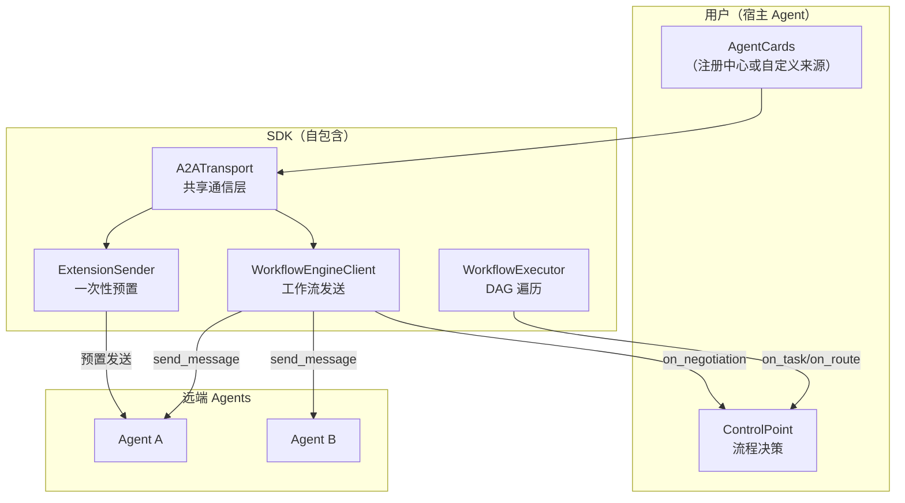

# a2at-engine

独立工作流执行 SDK，支持宿主 Agent 执行编排中心工作流（PSOP），同时保留对 A2A 通信、A2A-T 扩展与路由决策的完全控制权。SDK 自包含，不依赖编排中心任何代码。

> 完整设计参见 [DESIGN.md](DESIGN.md)。本文档面向集成者，快速上手与接口说明。

## 设计原则

| SDK 提供（协议机制） | 用户控制（业务决策） |
|---|---|
| A2A 消息发送、流式、SSE 归一化 | 何时 / 是否发送任务 |
| Agent 认证（Bearer、自定义 Header，基于 AgentCard） | 凭据配置 |
| A2A-T 扩展（Task-T、Negotiation-T、Authorization-T、Notification-T） | 授权审批、通知处理 |
| DAG 遍历、上下文组装、状态管理 | 分支路由决策 |
| 事件追踪 | 事件处理方式 |

## 架构

共享传输层 + 两个门面，职责单一：

```
A2ATransport（共享通信层：httpx + 认证 + AgentCard 映射 + SSE 消费）
  ├── WorkflowEngineClient（工作流发送门面：Task-T 生成、Negotiation-T 自动循环、事件回调、ControlPoint 装配）
  └── ExtensionSender（一次性预置门面：Authorization-T / Notification-T 发送）
```

决策层接口：

- **ControlPoint** — 流程决策（`on_task` / `on_self_task` / `on_route` / `on_negotiation`）

Authorization-T 和 Notification-T 是预置操作，在工作流启动前通过 `ExtensionSender` 单向下发，不在工作流执行中回调。



## 快速开始

```python
import asyncio
from a2at_engine import (
    execute_psop, ControlPoint, RouteDecision,
    TaskResponse, RegistryClient, load_psop,
)


class MyControlPoint(ControlPoint):
    async def on_task(self, request, engine_client):
        # SDK 已组装完整消息（上下文 + 任务 + 语言提示），直接发送
        result = await engine_client.send_message(
            request.agent_name, request.message
        )
        return TaskResponse(success=bool(result.text), output=result.text)

    async def on_route(self, step_name, results, conditions):
        # conditions: List[JumpCondition]，每个含 .step 与 .condition
        # 用你的 LLM 或业务逻辑选一个分支
        return RouteDecision(next_step=conditions[0].step)


async def main():
    # 1. 获取 AgentCards（注册中心或自定义来源）
    registry = RegistryClient(url="https://127.0.0.1:5000", ssl_verify=False)
    agent_cards = await registry.fetch_agent_cards()

    # 2. 加载 PSOP 工作流
    workflow = await load_psop(
        base_url="https://127.0.0.1:5001",
        psop_id="your-psop-id",
        ssl_verify=False,
    )

    # 3. 执行：execute_psop 内部构建 A2ATransport + WorkflowEngineClient
    async for event in execute_psop(
        psop=workflow,
        agent_cards=agent_cards,
        control_point=MyControlPoint(),
        a2at_env_path=".env",
        credentials_config="agent_credentials.json",
        runtime_intent="诊断 SPN 跨市故障",
        ssl_verify=False,
    ):
        print(f"[{event['type']}] {event['data']}")


if __name__ == "__main__":
    asyncio.run(main())
```

## 分层入口

| 层 | 入口 | 处理 | 你提供 |
|---|---|---|---|
| 2（高） | `execute_psop()` | 事件流、生命周期、取消、onFinish | ControlPoint + AgentCards + 配置 |
| 1（中） | `WorkflowExecutor` | DAG 遍历、上下文组装、调度 | ControlPoint + WorkflowEngineClient + Workflow |
| 0（低） | `A2ATransport` + 两个门面 | A2A 发送、认证、扩展、SSE | AgentCards + 配置 |

大多数集成使用第 2 层。需要手动控制时使用第 1 层。仅做一次性预置发送时直接使用 `ExtensionSender`。

## 用户实现的接口

### ControlPoint（流程决策）

| 方法 | 必需 | 调用时机 | 决定 |
|---|---|---|---|
| `on_task(request, engine_client)` | 是 | 步骤需向 Agent 发送任务 | 是否 / 如何发送 |
| `on_self_task(request)` | 否（默认回显） | SELF_LOOP 步骤 | 本地处理结果 |
| `on_route(step_name, results, conditions)` | 是 | 步骤有条件分支 | 走哪个分支 |
| `on_negotiation(agent_name, text, result)` | 否（默认通用澄清） | Agent 返回 INPUT_REQUIRED | 补充澄清文本 |

## A2ATransport + 门面（第 0 层）

```python
from a2at_engine import A2ATransport, WorkflowEngineClient, ExtensionSender

transport = A2ATransport(
    agent_cards=agent_cards,
    a2at_env_path=".env",
    credentials_config="agent_credentials.json",
    ssl_verify=False,
)

# 工作流发送门面
engine_client = WorkflowEngineClient(transport)

# 一次性预置门面（工作流开始前）
sender = ExtensionSender(transport)
auth_result = await sender.send_authorization("agent_a", "授权诊断操作", "诊断 SPN 跨市故障")
notif_result = await sender.send_notification("agent_a", "订阅恢复结果通知", "诊断 SPN 跨市故障")
```

两个门面共享同一个 transport，不重复 wire 代码。

**前置操作的回调**：Authorization-T 和 Notification-T 是工作流开始前的一次性操作，通过 `ExtensionSender` 发送。发送结果直接通过返回的 `SendMessageResult` 获取，无需额外的回调接口。

## A2A-T 扩展

| 扩展 | 归属 | 说明 |
|---|---|---|
| Task-T | 工作流链路 | 发送时由 SDK 生成结构化任务提示并注入 `metadata["...Task-T/v1"]` |
| Negotiation-T | 工作流链路 | 接收时从 `metadata["...NEGOTIATION-T"]` 提取协商上下文，驱动自动循环 |
| Authorization-T | 一次性预置 | 工作流开始前通过 `ExtensionSender` 发送，`instruction` → `parts[].text`，`natural_language_input` → SDK 生成结构化策略 → `metadata["...Authorization-T/v1"]` |
| Notification-T | 一次性预置 | 工作流开始前通过 `ExtensionSender` 发送，`instruction` → `parts[].text`，`natural_language_input` → SDK 生成结构化订阅 → `metadata["...Notification-T/v1"]` |

`ExtensionRegistry` 自动注册 Task-T 与 Negotiation-T（工作流内处理器）；Authorization-T / Notification-T 是预置操作，不自动注册，其 handler 类保留供手动注册处理 Agent 内联推送的数据。

## 智能体认证配置

当 AgentCard 声明 `securitySchemes` 与 `securityRequirements` 时，SDK 自动通过登录接口获取 token 并将认证头附加到出站请求。创建 JSON 文件：

```json
{
  "agent_a": {
    "bearerAuth": {
      "login_url": "https://127.0.0.1:8080/auth/login",
      "method": "POST",
      "content_type": "application/json",
      "request_fields": { "username": "user", "password": "pass" },
      "token_field": "access_token",
      "token_ttl": 3600,
      "auth_header": "Authorization",
      "auth_header_prefix": "Bearer "
    }
  }
}
```

| 字段 | 必填 | 默认 | 说明 |
|---|---|---|---|
| login_url | 是 | - | 获取 token 的 URL |
| method | 否 | POST | HTTP 方法 |
| content_type | 否 | application/json | 请求内容类型 |
| request_fields | 否 | - | 请求体字段（覆盖 username/password） |
| token_field | 否 | accessSession | 响应中提取 token 的路径（点分隔） |
| token_ttl | 否 | 3600 | token 缓存时长（秒） |
| auth_header | 否 | Authorization | 自定义认证头名 |
| auth_header_prefix | 否 | 空 | token 前缀（如 Bearer） |
| accept_header | 否 | - | 自定义 Accept 头 |

智能体名称须与 AgentCard 的 `name` 一致；认证方案名须与 `securitySchemes` 键一致。也可直接传 dict：`credentials_config=dict`。参见 `examples/agent_credentials.example.json`。

**密码加密:**

`request_fields` 中的密码字段支持 `enc:` 前缀加密格式 `enc:<base64-iv>:<base64-ciphertext>`，算法为 AES-256-GCM。SDK 运行时从 `A2AT_CRED_KEY` 环境变量读取密钥自动解密。

```bash
# 1. 生成 32 字节密钥 (仅首次)
python -c "import secrets; print(secrets.token_hex(32))"

# 2. 设置密钥环境变量
export A2AT_CRED_KEY=a1b2c3d4e5f6a7b8c9d0e1f2a3b4c5d6e7f8a9b0c1d2e3f4a5b6c7d8e9f0a1b2

# 3. 加密密码
python -c "from a2at_engine.client.credential_crypto import encrypt; print(encrypt('Admin@123'))"
# 输出: enc:xxxxxxxxxxxx:yyyyyyyyyyyyyyyyyyyyyyyyyyyyyyyyyyyy
```

将输出的 `enc:...` 值填入 credentials JSON 的密码字段即可。

### 自定义 AuthProvider

对于非标准认证（企业 SSO、外部身份提供商、AgentCard 无 `securitySchemes` 但仍需认证），实现 `AuthProvider` ABC：

```python
from a2at_engine import AuthProvider

class SsoAuthProvider(AuthProvider):
    def apply_auth(self, agent_name: str, agent_card, headers: dict) -> None:
        token = sso_client.get_access_token(agent_name)
        headers["Authorization"] = f"Bearer {token}"

transport = A2ATransport(
    agent_cards=agent_cards,
    auth_provider=SsoAuthProvider(),
)
```

两种方式可组合使用：`AuthProvider` 先执行，credentials 认证后执行，各自向请求头注入认证信息。

## 文件结构

```
workflow-exec-engine/
├── README.md              # 本文档
├── README_en.md           # English
├── DESIGN.md              # 设计文档
├── DEVELOPER_GUIDE.md     # 开发者指南
├── pyproject.toml
├── examples/
│   ├── quickstart.py
│   └── execute_psop_demo.py
└── a2at_engine/
    ├── __init__.py         # 公共 API 导出
    ├── runner.py           # execute_psop 高层运行器
    ├── core/               # 核心执行
    │   ├── models.py       # 数据模型
    │   ├── context_builder.py
    │   └── executor.py     # WorkflowExecutor DAG 遍历
    ├── client/             # 通信层
    │   ├── a2a_transport.py     # A2ATransport 共享通信层
    │   ├── engine_client.py     # WorkflowEngineClient 工作流门面
    │   ├── extension_sender.py  # ExtensionSender 一次性门面
    │   ├── extension_handlers.py
    │   ├── extensions.py        # A2ATExtension 枚举
    │   ├── auth_manager.py
    │   ├── credential_service.py
    │   ├── ssl_context.py
    │   └── sse_normalization.py
    ├── control/            # 决策接口
    │   └── control_points.py    # ControlPoint + EventType
    └── registry/           # 注册中心集成（可选）
        └── registry_client.py
```

## 许可证

Apache License 2.0