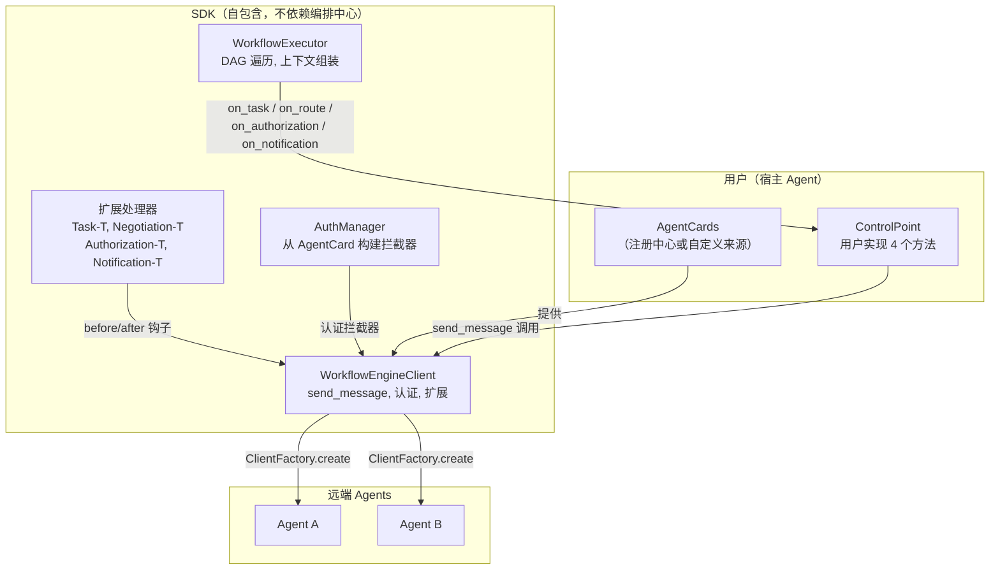
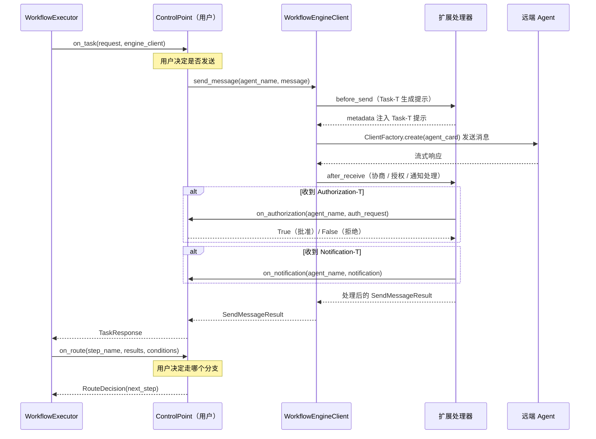

# 工作流执行 SDK

独立 SDK，支持宿主 Agent 执行编排中心工作流（PSOP），同时保留对 A2A 通信和路由决策的完全控制权。

## 设计原则

| SDK 提供（通用能力） | 用户控制（决策层） |
|---|---|
| A2A 消息发送（ClientFactory、协议、流式） | 何时/是否发送任务 |
| Agent 认证（Bearer、自定义 Header，基于 AgentCard） | 凭据配置 |
| A2A-T 扩展（Task-T、Negotiation-T、Authorization-T、Notification-T） | 授权审批、通知处理 |
| DAG 遍历、上下文组装、状态管理 | 分支路由决策 |
| 事件追踪 | 事件处理方式 |

## 架构



## 执行流程



## 快速开始

```python
from a2at_engine import (
    WorkflowExecutor, ControlPoint, WorkflowEngineClient, RegistryClient,
    Workflow, TaskResponse, RouteDecision,
)

# 1. 获取 AgentCards（用户负责——从注册中心或自定义来源）
registry = RegistryClient(url="https://127.0.0.1:5000")
agent_cards = await registry.fetch_agent_cards()

# 2. 创建 WorkflowEngineClient（SDK 处理认证、扩展、协议）
engine_client = WorkflowEngineClient(
    agent_cards=agent_cards,
    a2at_env_path=".env",
    credentials_config="agent_credentials.json",
)

# 3. 实现 ControlPoint（用户的决策层）
class MyControlPoint(ControlPoint):
    async def on_task(self, request, engine_client):
        result = await engine_client.send_message(
            request.agent_name, request.message
        )
        return TaskResponse(success=True, output=result.text)

    async def on_route(self, step_name, results, conditions):
        chosen = my_agent_llm.decide(results, conditions)
        return RouteDecision(next_step=chosen)

    async def on_authorization(self, agent_name, auth_request):
        return True

    async def on_notification(self, agent_name, notification):
        print(f"Notification from {agent_name}: {notification}")

# 4. 加载工作流并执行
workflow = await WorkflowExecutor.load_workflow_from_orchestration_center(
    base_url="http://127.0.0.1:5001", psop_id="abc-123",
    access_token="your-token-if-auth-enabled"
)
executor = WorkflowExecutor(
    workflow=workflow,
    control_point=MyControlPoint(),
    engine_client=engine_client,
    runtime_intent="诊断 SPN 跨市故障",
)
result = await executor.run()
```

## 用户需要实现的接口

### ControlPoint（on_task / on_route 必需，其余可选）

`on_authorization` 和 `on_notification` 有默认实现（批准 / no-op），仅在对应扩展处理器注册时被调用。

| 方法 | 必需？ | 调用时机 | 用户决定 |
|------|--------|---------|---------|
| `on_task(request, engine_client)` | 是 | 步骤需要向 Agent 发送任务 | 是否/如何发送，返回什么结果 |
| `on_route(step_name, results, conditions)` | 是 | 步骤有多个分支 | 走哪个分支 |
| `on_authorization(agent_name, auth_request)` | 否（默认批准） | Agent 返回 Authorization-T 请求 | 授权/拒绝 |
| `on_notification(agent_name, notification)` | 否（默认 no-op） | Agent 推送 Notification-T 消息 | 如何处理通知 |

### WorkflowEngineClient（SDK 提供，用户调用）

| 方法 | 说明 |
|------|------|
| `send_message(agent_name, message)` | 发送 A2A 消息，自动处理认证 + 扩展 |
| `send_message_with_negotiation(agent_name, message)` | 同上 + 自动协商处理 |
| `update_agent_cards(cards)` | 更新 AgentCards（注册中心刷新后） |
| `agent_names` | 已注册的 Agent 名称列表 |
| `normalize_agent_dict(dict)` | 归一化 AgentCard dict 为 protobuf 格式 |

### EventCallback（可选）

```python
from a2at_engine import EventCallback
class MyEventCallback(EventCallback):
    def on_event(self, event_type, data):
        print(f"[{event_type}] {data}")
```

## 智能体认证配置

当 AgentCard 声明了 securitySchemes 和 securityRequirements 时，SDK 会自动通过登录接口获取 token，并将认证头附加到出站请求上。

创建 JSON 文件（如 agent_credentials.json），结构如下：

~~~json
{
  "智能体名称": {
    "认证方案名": {
      "login_url": "https://127.0.0.1:8080/auth/login",
      "method": "POST",
      "content_type": "application/json",
      "request_fields": {
        "username": "用户名",
        "password": "密码"
      },
      "token_field": "access_token",
      "token_ttl": 3600
    }
  }
}
~~~

### 字段说明

| 字段 | 必填 | 默认值 | 说明 |
|------|------|---------|------|
| login_url | 是 | - | 获取 token 的 URL |
| method | 否 | POST | HTTP 方法（POST、PUT 等） |
| content_type | 否 | application/json | application/json 或 application/x-www-form-urlencoded |
| request_fields | 否 | - | 请求体字段字典（覆盖 username/password） |
| username | 否 | - | 用户名（当 request_fields 不存在时使用） |
| password | 否 | - | 密码（当 request_fields 不存在时使用） |
| username_field | 否 | username | 请求体中用户名的字段名 |
| password_field | 否 | password | 请求体中密码的字段名 |
| token_field | 否 | accessSession | 从响应中提取 token 的路径（点分隔，如 data.access_token） |
| token_ttl | 否 | 3600 | token 缓存时长（秒） |
| auth_header | 否 | Authorization | 自定义认证头名称 |
| auth_header_prefix | 否 | 空 | token 前缀（如 Bearer ） |
| accept_header | 否 | - | 自定义 Accept 头值 |

- 智能体名称必须与 AgentCard 的 name 字段一致。
- 认证方案名必须与 AgentCard 的 securitySchemes 的键一致。
- AgentCard 中没有 securitySchemes 的智能体不需要配置。
- 参见 examples/agent_credentials.example.json 获取完整示例。
- 除文件路径外，也可直接传入 dict：credentials_config=dict。

## A2A-T 扩展处理器

SDK 内置处理器，不是用户实现的。当 A2A-T SDK 新增扩展类型时，在 SDK 中添加对应处理器即可。

| 处理器 | 扩展类型 | 说明 | 是否涉及用户决策 |
|--------|---------|------|----------------|
| `TaskTHandler` | Task-T | 通过 A2ATClient 生成结构化任务提示 | 否（自动） |
| `NegotiationTHandler` | Negotiation-T | 处理协商上下文，提取协商消息 | 是（用户解决协商） |
| `AuthorizationTHandler` | Authorization-T | 处理授权请求，委托 `on_authorization` | 是（用户批准/拒绝） |
| `NotificationTHandler` | Notification-T | 处理通知推送，委托 `on_notification` | 是（用户处理通知） |

`AuthorizationTHandler` 和 `NotificationTHandler` 已实现，在 A2A-T SDK 支持后取消注释启用。

## 文件结构

\workflow-exec-engine/
├── README.md                     # 中文文档
├── README_en.md                  # English documentation
├── requirements.txt              # Python 依赖
├── setup.py                       # 包安装
├── examples/
│   └── quickstart.py             # 快速开始示例
└── a2at_engine/
    ├── __init__.py               # 公共 API 导出
    ├── core/                     # 核心执行逻辑
    │   ├── __init__.py
    │   ├── models.py             # 数据模型
    │   ├── context_builder.py     # 上下文组装
    │   └── executor.py           # WorkflowExecutor — DAG 遍历
    ├── client/                   # 通信层（自包含）
    │   ├── __init__.py
    │   ├── engine_client.py      # WorkflowEngineClient
    │   ├── auth_manager.py       # AuthManager — 从 AgentCard 构建拦截器
    │   ├── extension_handlers.py # 四种 A2A-T 处理器
    │   ├── sse_normalization.py  # SSE 响应归一化
    │   ├── ssl_context.py        # SSL 上下文工具
    │   ├── credential_service.py # 凭据服务 + 认证拦截器
    │   ├── extension_interceptor.py # A2A-Extensions 头注入
    │   └── agentcard_normalizer.py  # AgentCard 格式归一化
    ├── control/                  # 用户面向接口
    │   ├── __init__.py
    │   └── control_points.py     # ControlPoint + EventCallback
    └── registry/                 # 注册中心集成（可选）
        ├── __init__.py
        └── registry_client.py    # 从注册中心拉取 AgentCards
\
## 依赖关系

\registry/  ──── depends on ───> client/ (agentcard_normalizer)
control/   ──── depends on ───> core/ (models)
client/    ──── depends on ───> core/ (models), a2a-sdk, a2a-t-sdk (external)
core/      ──── depends on ───> core/ (self), control/ (type hints only)
\
SDK 不依赖编排中心的任何代码。

## 与编排中心 DynamicWorkflowEngine 的对比

| 职责 | DynamicWorkflowEngine | SDK |
|------|----------------------|-----|
| DAG 遍历 | 是 | 是 |
| 上下文组装 | 是 | 是 |
| A2A client 创建 | 是（ClientFactory） | 是（WorkflowEngineClient 封装） |
| Agent 认证 | 是（自动） | 是（自动，基于 AgentCard） |
| A2A-T 扩展 | 是（Task-T、Negotiation-T） | 是（可插拔注册，支持四种扩展） |
| **何时发送** | 自动（引擎决定） | **用户决定**（on_task） |
| **路由决策** | 自动（LLM） | **用户决定**（on_route） |
| **授权审批** | 不支持 | **用户决定**（on_authorization） |
| **通知处理** | 不支持 | **用户决定**（on_notification） |

## 许可证

Apache License 2.0
