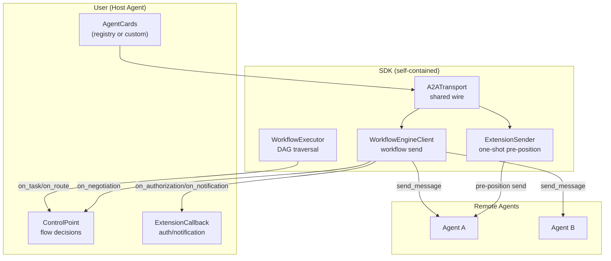

# a2at-engine

Standalone workflow execution SDK for A2A-T multi-agent orchestration. The host agent executes orchestration-center workflows (PSOP) while retaining full control over A2A communication, A2A-T extensions, and routing decisions. The SDK is self-contained and does not depend on the orchestration center.

> For the full design see [DESIGN.md](DESIGN.md). This document targets integrators: quick start and interface reference.

## Principle

| The SDK owns (protocol mechanics) | The host owns (business decisions) |
|---|---|
| A2A message send, streaming, SSE normalization | Whether and when to send a task |
| Agent auth (Bearer, custom headers, from AgentCard) | Credential configuration |
| A2A-T extensions (Task-T, Negotiation-T, Authorization-T, Notification-T) | Authorization approval, notification handling |
| DAG traversal, context assembly, state management | Branch routing decisions |
| Event tracking | Event handling strategy |

## Architecture

A shared transport with two single-responsibility facades:

```
A2ATransport (shared wire: httpx + auth + agent-card map + SSE consumer)
  |-- WorkflowEngineClient (workflow facade: Task-T generation, Negotiation-T
  |                          auto-loop, event callback, ControlPoint/ExtensionCallback)
  `-- ExtensionSender (one-shot facade: Authorization-T / Notification-T)
```

The decision layer is split into two interfaces:

- **ControlPoint** -- flow decisions (`on_task` / `on_self_task` / `on_route` / `on_negotiation`)
- **ExtensionCallback** -- reactive hooks for agent-pushed A2A-T data (`on_authorization` / `on_notification`)



## Quick Start

```python
import asyncio
from a2at_engine import (
    execute_psop, ControlPoint, ExtensionCallback, RouteDecision,
    RegistryClient, load_psop,
)


class MyControlPoint(ControlPoint):
    async def on_task(self, request, engine_client):
        # SDK assembles the full message (context + task + lang hint)
        result = await engine_client.send_message(
            request.agent_name, request.message
        )
        return TaskResponse(success=bool(result.text), output=result.text)

    async def on_route(self, step_name, results, conditions):
        # conditions: List[JumpCondition], each with .step and .condition
        return RouteDecision(next_step=conditions[0].step)


class MyExtCallback(ExtensionCallback):
    async def on_authorization(self, agent_name, auth_request):
        return True  # approve

    async def on_notification(self, agent_name, notification):
        print(f"Notification from {agent_name}: {notification}")


async def main():
    # 1. Get AgentCards (registry or custom source)
    registry = RegistryClient(url="https://127.0.0.1:5000", ssl_verify=False)
    agent_cards = await registry.fetch_agent_cards()

    # 2. Load a PSOP workflow
    workflow = await load_psop(
        base_url="https://127.0.0.1:5001",
        psop_id="your-psop-id",
        ssl_verify=False,
    )

    # 3. Execute: execute_psop builds A2ATransport + WorkflowEngineClient internally
    async for event in execute_psop(
        psop=workflow,
        agent_cards=agent_cards,
        control_point=MyControlPoint(),
        extension_callback=MyExtCallback(),
        a2at_env_path=".env",
        credentials_config="agent_credentials.json",
        runtime_intent="Diagnose SPN cross-city fault",
        ssl_verify=False,
    ):
        print(f"[{event['type']}] {event['data']}")


if __name__ == "__main__":
    asyncio.run(main())
```

## Layered Entry Points

| Layer | Entry Point | Handles | You Provide |
|---|---|---|---|
| 2 (high) | `execute_psop()` | Event stream, lifecycle, cancellation, onFinish | ControlPoint + ExtensionCallback + AgentCards + config |
| 1 (mid) | `WorkflowExecutor` | DAG traversal, context assembly, dispatch | ControlPoint + WorkflowEngineClient + Workflow |
| 0 (low) | `A2ATransport` + two facades | A2A send, auth, extensions, SSE | AgentCards + config |

Most integrations use Layer 2. Use Layer 1 for manual control. Use `ExtensionSender` directly for one-shot pre-positioning only.

## Interfaces to Implement

### ControlPoint (flow decisions)

| Method | Required | Called when | Decides |
|---|---|---|---|
| `on_task(request, engine_client)` | yes | a step needs to send a task | whether/how to send |
| `on_self_task(request)` | no (default echoes) | a SELF_LOOP step | local result |
| `on_route(step_name, results, conditions)` | yes | a step has conditional branches | which branch |
| `on_negotiation(agent_name, text, result)` | no (default generic) | agent returns INPUT_REQUIRED | clarification text |

### ExtensionCallback (reactive hooks)

| Method | Required | Fires when | Decides |
|---|---|---|---|
| `on_authorization(agent_name, auth_request)` | no (default approve) | agent pushes Authorization-T in a task response | approve/deny |
| `on_notification(agent_name, notification)` | no (default no-op) | agent pushes Notification-T in a task response | how to handle |

> The subscription *result* (e.g. a recovery outcome the agent pushes later) flows back through the `send_notification` response stream, not through `onNotification`. The hook only fires when an agent voluntarily includes a Notification-T payload in a `sendMessage` task response.

## A2ATransport + Facades (Layer 0)

```python
from a2at_engine import A2ATransport, WorkflowEngineClient, ExtensionSender

transport = A2ATransport(
    agent_cards=agent_cards,
    a2at_env_path=".env",
    credentials_config="agent_credentials.json",
    ssl_verify=False,
)

# Workflow send facade
engine_client = WorkflowEngineClient(transport)
engine_client.set_extension_callback(MyExtCallback())

# One-shot pre-positioning facade (before workflow starts)
sender = ExtensionSender(transport)
await sender.send_authorization("agent_a", "authorize diagnosis", "Diagnose SPN cross-city fault")
await sender.send_notification("agent_a", "subscribe to recovery result", "Diagnose SPN cross-city fault")
```

Both facades share one transport; no wire code is duplicated.

## A2A-T Extensions

| Extension | Lifecycle | Description |
|---|---|---|
| Task-T | in-workflow | SDK generates a structured task prompt on send and injects into metadata |
| Negotiation-T | in-workflow | extracts negotiation context on receive, drives the auto-loop |
| Authorization-T | one-shot pre-position | sent via ExtensionSender before the workflow |
| Notification-T | one-shot pre-position | subscribes to result notifications (long-lived SSE) |

`ExtensionRegistry` auto-registers Task-T and Negotiation-T (in-workflow handlers); Authorization-T / Notification-T are pre-positioning operations, not auto-registered. Their handler classes are retained for callers that need inline handling of agent-pushed data.

## Agent Authentication

When an AgentCard declares `securitySchemes` and `securityRequirements`, the SDK logs in to obtain a token and attaches the auth header to outbound requests. Create a JSON file:

```json
{
  "agent_a": {
    "bearerAuth": {
      "login_url": "https://127.0.0.1:8080/auth/login",
      "method": "POST",
      "content_type": "application/json",
      "request_fields": { "username": "user", "password": "pass" },
      "token_field": "access_token",
      "token_ttl": 3600,
      "auth_header": "Authorization",
      "auth_header_prefix": "Bearer "
    }
  }
}
```

| Field | Required | Default | Description |
|---|---|---|---|
| login_url | yes | - | URL to obtain the token |
| method | no | POST | HTTP method |
| content_type | no | application/json | request content type |
| request_fields | no | - | request body fields (overrides username/password) |
| token_field | no | accessSession | response path to extract token (dot-separated) |
| token_ttl | no | 3600 | token cache TTL (seconds) |
| auth_header | no | Authorization | custom auth header name |
| auth_header_prefix | no | empty | token prefix (e.g. Bearer) |
| accept_header | no | - | custom Accept header |

Agent names must match the AgentCard `name`; scheme names must match `securitySchemes` keys. A dict may be passed directly: `credentials_config=dict`. See `examples/agent_credentials.example.json`.

## File Structure

```
workflow-exec-engine/
|-- README.md              # this document
|-- README_en.md           # English
|-- DESIGN.md              # design document
|-- DEVELOPER_GUIDE.md     # developer guide
|-- pyproject.toml
|-- examples/
|   |-- quickstart.py
|   `-- execute_psop_demo.py
`-- a2at_engine/
    |-- __init__.py         # public API exports
    |-- runner.py           # execute_psop high-level runner
    |-- core/               # core execution
    |   |-- models.py       # data models
    |   |-- context_builder.py
    |   `-- executor.py     # WorkflowExecutor DAG traversal
    |-- client/             # communication layer
    |   |-- a2a_transport.py     # A2ATransport shared wire
    |   |-- engine_client.py     # WorkflowEngineClient workflow facade
    |   |-- extension_sender.py  # ExtensionSender one-shot facade
    |   |-- extension_handlers.py
    |   |-- extensions.py        # A2ATExtension enum
    |   |-- auth_manager.py
    |   |-- credential_service.py
    |   |-- ssl_context.py
    |   `-- sse_normalization.py
    |-- control/            # decision interfaces
    |   `-- control_points.py    # ControlPoint + ExtensionCallback + EventType
    `-- registry/           # registry integration (optional)
        `-- registry_client.py
```

## License

Apache License 2.0