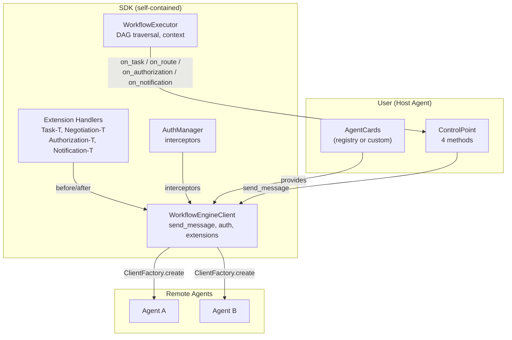
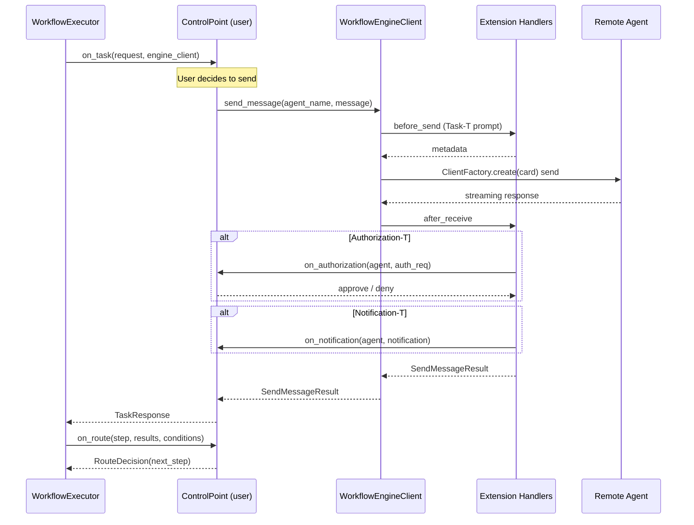

# Workflow Execution SDK

Standalone SDK for executing orchestration center workflows with control delegation.
The host agent retains full control over A2A communication and routing decisions.

## Principle

| SDK provides (common capabilities) | User controls (decision layer) |
|---|---|
| A2A message sending (ClientFactory, protocol, streaming) | When/whether to send a task |
| Agent auth (Bearer, custom headers from AgentCard) | Credential configuration |
| A2A-T extensions (Task-T, Negotiation-T, Authorization-T, Notification-T) | Authorization approval, notification handling |
| DAG traversal, context assembly, state management | Route decisions at branches |
| Event tracking | Event handling strategy |

## Architecture



## Execution Flow



## Quick Start

```python
from a2at_engine import (
    WorkflowExecutor, ControlPoint, WorkflowEngineClient, RegistryClient,
    Workflow, TaskResponse, RouteDecision,
)

# 1. Fetch AgentCards (user's responsibility)
registry = RegistryClient(url="https://127.0.0.1:5000")
agent_cards = await registry.fetch_agent_cards()

# 2. Create WorkflowEngineClient (SDK handles auth, extensions, protocol)
engine_client = WorkflowEngineClient(
    agent_cards=agent_cards,
    a2at_env_path=".env",
    credentials_config="agent_credentials.json",
)

# 3. Implement ControlPoint (user's decision layer)
class MyControlPoint(ControlPoint):
    async def on_task(self, request, engine_client):
        result = await engine_client.send_message(
            request.agent_name, request.message
        )
        return TaskResponse(success=True, output=result.text)

    async def on_route(self, step_name, results, conditions):
        chosen = my_agent_llm.decide(results, conditions)
        return RouteDecision(next_step=chosen)

    async def on_authorization(self, agent_name, auth_request):
        return True

    async def on_notification(self, agent_name, notification):
        print(f"Notification from {agent_name}: {notification}")

# 4. Load workflow and execute
workflow = await WorkflowExecutor.load_workflow_from_orchestration_center(
    base_url="http://127.0.0.1:5001", psop_id="abc-123",
    access_token="your-token-if-auth-enabled"
)
executor = WorkflowExecutor(
    workflow=workflow,
    control_point=MyControlPoint(),
    engine_client=engine_client,
    runtime_intent="Diagnose SPN cross-city fault",
)
result = await executor.run()
```

## User-Facing APIs

### ControlPoint (on_task / on_route required, others optional)

`on_authorization` and `on_notification` have default implementations (approve / no-op) and are only invoked when the corresponding extension handler is registered.

| Method | Required? | When called | User decides |
|--------|-----------|-------------|-------------|
| `on_task(request, engine_client)` | Yes | Step needs to send a task | Whether/how to send, what to return |
| `on_route(step_name, results, conditions)` | Yes | Step has multiple branches | Which branch to take |
| `on_authorization(agent_name, auth_request)` | No (default: approve) | Agent returns Authorization-T | Approve/deny |
| `on_notification(agent_name, notification)` | No (default: no-op) | Agent pushes Notification-T | How to handle |

### WorkflowEngineClient (SDK provides, user calls)

| Method | Description |
|--------|-------------|
| `send_message(agent_name, message)` | Send A2A message with auth + extensions |
| `send_message_with_negotiation(agent_name, message, negotiation_resolver=None)` | Same + auto negotiation via A2A-T receive/continue |
| `update_agent_cards(cards)` | Update AgentCards after registry refresh |
| `agent_names` | List of registered agent names |
| `normalize_agent_dict(dict)` | Normalize AgentCard dict to protobuf format |

### EventCallback (optional)

```python
from a2at_engine import EventCallback
class MyEventCallback(EventCallback):
    def on_event(self, event_type, data):
        print(f"[{event_type}] {data}")
```

## Agent Authentication

When an AgentCard declares securitySchemes and securityRequirements, the SDK
automatically obtains tokens via login and attaches auth headers to outbound requests.

Create a JSON file (e.g. agent_credentials.json) with the following structure:

~~~json
{
  "Agent Name": {
    "schemeName": {
      "login_url": "https://127.0.0.1:8080/auth/login",
      "method": "POST",
      "content_type": "application/json",
      "request_fields": {
        "username": "YOUR_USERNAME",
        "password": "YOUR_PASSWORD"
      },
      "token_field": "access_token",
      "token_ttl": 3600
    }
  }
}
~~~

### Field Reference

| Field | Required | Default | Description |
|-------|----------|---------|-------------|
| login_url | Yes | - | URL to obtain the access token |
| method | No | POST | HTTP method (POST, PUT, etc.) |
| content_type | No | application/json | application/json or application/x-www-form-urlencoded |
| request_fields | No | - | Dict of body fields (overrides username/password) |
| username | No | - | Username (used when request_fields is absent) |
| password | No | - | Password (used when request_fields is absent) |
| username_field | No | username | Body field name for username |
| password_field | No | password | Body field name for password |
| token_field | No | accessSession | Dot-separated path to extract token (e.g. data.access_token) |
| token_ttl | No | 3600 | Token cache TTL in seconds |
| auth_header | No | Authorization | Custom header name for the token |
| auth_header_prefix | No | (empty) | Prefix before the token (e.g. Bearer ) |
| accept_header | No | - | Custom Accept header value |

- Agent Name must match the name field in the AgentCard.
- Scheme Name must match a key in the AgentCard securitySchemes.
- Agents without securitySchemes in their AgentCard do not need an entry.
- See examples/agent_credentials.example.json for complete examples.
- Instead of a file path, you can also pass a dict directly: credentials_config=dict.

## A2A-T Extension Handlers

SDK-internal handlers (not user-implemented). When A2A-T SDK adds new extension types,
add corresponding handlers to the SDK.

| Handler | Extension | Description | User decision? |
|---------|-----------|-------------|----------------|
| `TaskTHandler` | Task-T | Generates structured prompts via A2ATClient | No (automatic) |
| `NegotiationTHandler` | Negotiation-T | Extracts negotiation context | Yes (user resolves) |
| `AuthorizationTHandler` | Authorization-T | Delegates to `on_authorization` | Yes (approve/deny) |
| `NotificationTHandler` | Notification-T | Delegates to `on_notification` | Yes (user handles) |

`AuthorizationTHandler` and `NotificationTHandler` are implemented but commented out.
Uncomment when A2A-T SDK adds support.

## File Structure

`
workflow-exec-engine/
├── README.md                     # Chinese documentation
├── README_en.md                  # English documentation
├── LICENSE                       # Apache 2.0 license
├── pyproject.toml                # Package metadata + build config
├── requirements.txt              # Python dependencies
├── MANIFEST.in                   # Package manifest
├── examples/
│   ├── quickstart.py             # Quick start example
│   └── agent_credentials.example.json  # Auth config example
└── a2at_engine/
    ├── __init__.py               # Public API exports
    ├── core/                     # Core execution logic
    │   ├── __init__.py
    │   ├── models.py             # Data models (Workflow, Task, etc.)
    │   ├── context_builder.py    # Context assembly from upstream outputs
    │   └── executor.py           # WorkflowExecutor -- DAG traversal
    ├── client/                   # Communication layer (self-contained)
    │   ├── __init__.py
    │   ├── engine_client.py      # WorkflowEngineClient
    │   ├── auth_manager.py       # AuthManager -- interceptors from AgentCard
    │   ├── extension_handlers.py # 4 A2A-T handlers
    │   ├── sse_normalization.py  # SSE response normalization
    │   ├── ssl_context.py        # SSL context factory
    │   ├── credential_service.py # Credential service + auth interceptors
    │   ├── extension_interceptor.py # A2A-Extensions header injection
    │   └── agentcard_normalizer.py  # AgentCard normalization
    ├── control/                  # User-facing interfaces
    │   ├── __init__.py
    │   └── control_points.py     # ControlPoint + EventCallback
    └── registry/                 # Registry integration (optional)
        ├── __init__.py
        └── registry_client.py    # Fetch AgentCards from registry
`

## Dependencies

`
registry/  ─── depends on ───> client/ (agentcard_normalizer)
control/   ─── depends on ───> core/ (models)
client/    ─── depends on ───> core/ (models), a2a-sdk, a2a-t-sdk (external)
core/      ─── depends on ───> core/ (self), control/ (type hints only)
`

## Comparison with Orchestration Center

| Responsibility | DynamicWorkflowEngine | SDK |
|----------------|----------------------|-----|
| DAG traversal | Yes | Yes |
| Context assembly | Yes | Yes |
| A2A client creation | Yes (ClientFactory) | Yes (WorkflowEngineClient wraps it) |
| Agent auth | Yes (auto) | Yes (auto, from AgentCard) |
| A2A-T extensions | Yes (Task-T, Negotiation-T) | Yes (pluggable, 4 extensions) |
| **When to send** | Auto (engine decides) | **User decides** (on_task) |
| **Route decisions** | Auto (LLM) | **User decides** (on_route) |
| **Authorization** | Not supported | **User decides** (on_authorization) |
| **Notifications** | Not supported | **User decides** (on_notification) |

## License

Apache License 2.0
